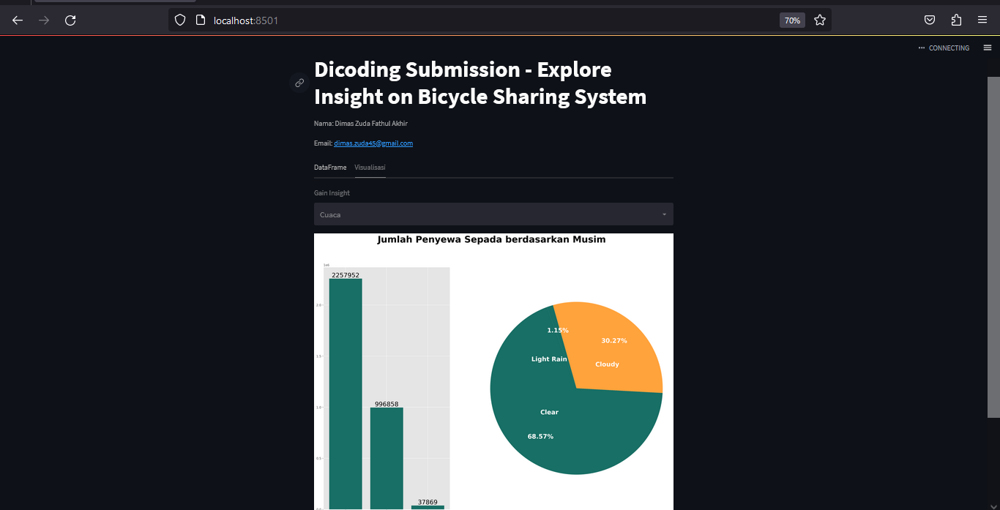

# DICODING SUBMISSION

# Belajar Analisis Data dengan Python

---

## Identity

### Nama: Dimas Zuda Fathul Akhir

### Email: dimas.zuda45@gmail.com

  

### How to run Streamlit API

- Open the terminal and go to dashboard directory
- Type `python -m venv .venv` and hit enter
- Type `.venv/Scripts/activate` and hit enter
- Then type `pip install -r requirements.txt`
- Now open the API by typing `streamlit run main.py`
- Wait until it finish. it will run on `http://localhost:8501`
